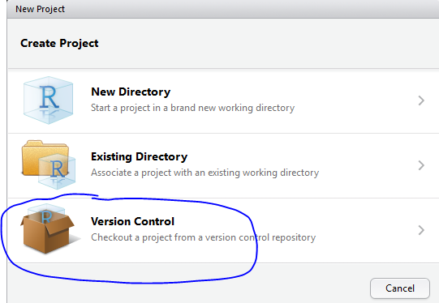
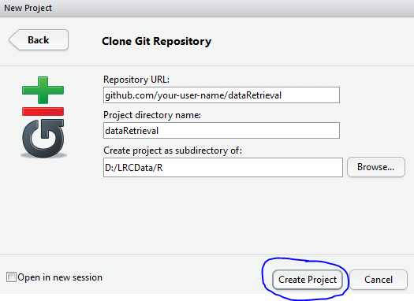
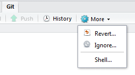
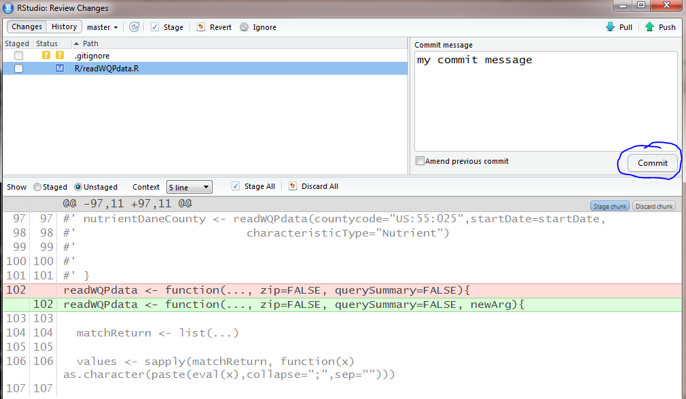
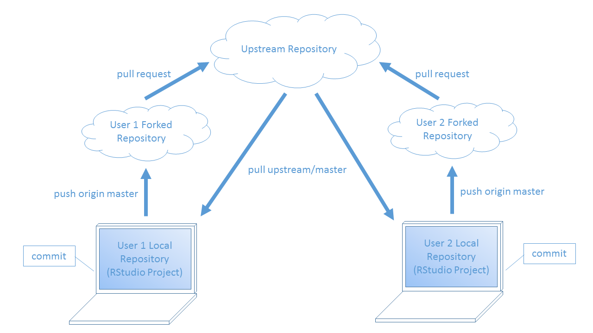

Version control is a tool that allows you to keep track of changes to a number of files. Using version control for package development means that you can easily revert to previous package versions, collaborate with multiple developers, and record reasons for the changes that are made. For this course, we will only discuss the version control language Git and its web interface, GitHub.

Lesson Objectives
-----------------

1.  Define version control and give examples of how it is useful.
2.  Navigate the GitHub interface.
3.  Summarize a typical GitHub-to-R workflow.

Why version control?
--------------------

Version control systems allow you to have organized code repositories by tracking changes. There are many version control systems, but we will only be covering Git in this course. Git can track every change made to a file, annotate the change, and keep record of the change through time. Git maintains a history of the code base and allows you to revert to previous versions if necessary. Git refers to the version control language and commands are typed into the terminal starting with the word `git`.

A web interface called GitHub allows users to visually see their tracked changes and has additional features, such as issues, milestones, review requests, and commenting. With GitHub, changes to code can be associated with bugs and feature requests. GitHub also enables open science practices by sharing what goes on "behind-the-scenes" in the code. In addition, GitHub is a great tool for collaborative work because issues, comments, and peer reviews can be associated with a specific GitHub user account. Each user can edit the code at the same time and handle conflicts appropriately.

In this course, we will be using Git and GitHub in conjunction with RStudio to complete version control workflows.

Setting up Git to work with RStudio
-----------------------------------

?? Git Bash? Should this go in the initial setup page under Getting Started? SSH

Git/GitHub Definitions
----------------------

Here are some terms to be familiar with as we go through our recommended version control workflow.

<table class="gmisc_table" style="border-collapse: collapse; margin-top: 1em; margin-bottom: 1em;">
<thead>
<tr>
<td colspan="2" style="text-align: left;">
Table 1. Common Git and GitHub definitions
</td>
</tr>
<tr>
<th style="border-bottom: 1px solid grey; border-top: 2px solid grey; text-align: center;">
Term
</th>
<th style="border-bottom: 1px solid grey; border-top: 2px solid grey; text-align: center;">
Definition
</th>
</tr>
</thead>
<tbody>
<tr>
<td style="padding-bottom: 0.5em; padding-right: 0.5em; padding-top: 0.5em; text-align: left;">
repository
</td>
<td style="padding-bottom: 0.5em; padding-right: 0.5em; padding-top: 0.5em; text-align: left;">
a collection of files, aka repo
</td>
</tr>
<tr style="background-color: #f7f7f7;">
<td style="padding-bottom: 0.5em; padding-right: 0.5em; padding-top: 0.5em; background-color: #f7f7f7; text-align: left;">
fork
</td>
<td style="padding-bottom: 0.5em; padding-right: 0.5em; padding-top: 0.5em; background-color: #f7f7f7; text-align: left;">
a user's version of the original repository
</td>
</tr>
<tr>
<td style="padding-bottom: 0.5em; padding-right: 0.5em; padding-top: 0.5em; text-align: left;">
commit
</td>
<td style="padding-bottom: 0.5em; padding-right: 0.5em; padding-top: 0.5em; text-align: left;">
saved change(s) to code
</td>
</tr>
<tr style="background-color: #f7f7f7;">
<td style="padding-bottom: 0.5em; padding-right: 0.5em; padding-top: 0.5em; background-color: #f7f7f7; text-align: left;">
pull request
</td>
<td style="padding-bottom: 0.5em; padding-right: 0.5em; padding-top: 0.5em; background-color: #f7f7f7; text-align: left;">
a request to merge changes from one repository to another, aka PR
</td>
</tr>
<tr>
<td style="padding-bottom: 0.5em; padding-right: 0.5em; padding-top: 0.5em; text-align: left;">
branch
</td>
<td style="padding-bottom: 0.5em; padding-right: 0.5em; padding-top: 0.5em; text-align: left;">
specific instance of your fork; there can be more than one branch on any fork (all will have 'master' which is the main branch)
</td>
</tr>
<tr style="background-color: #f7f7f7;">
<td style="padding-bottom: 0.5em; padding-right: 0.5em; padding-top: 0.5em; background-color: #f7f7f7; text-align: left;">
upstream
</td>
<td style="padding-bottom: 0.5em; padding-right: 0.5em; padding-top: 0.5em; background-color: #f7f7f7; text-align: left;">
used to refer to the original repository
</td>
</tr>
<tr>
<td style="padding-bottom: 0.5em; padding-right: 0.5em; padding-top: 0.5em; border-bottom: 2px solid grey; text-align: left;">
master
</td>
<td style="padding-bottom: 0.5em; padding-right: 0.5em; padding-top: 0.5em; border-bottom: 2px solid grey; text-align: left;">
used to refer to your forked repository
</td>
</tr>
</tbody>
</table>
Our recommended workflow
------------------------

There are many ways to use Git, GitHub, and RStudio in your version control workflow. We will discuss the method USGS-R has predominately used. It is most similar to the "fork-and-branch" workflow (see the [additional resources](#additional-resources) section below). There are three locations of the repository: 1) master on GitHub, 2) forked repository on GitHub, and 3) the user's local repository.

### Initial version control setup for a project

The initial setup requires a master repository on GitHub. To create a new master repo on GitHub, follow [these instructions](https://help.github.com/articles/creating-a-new-repository/). Once there is a master repository, the user looking to contribute to this code base would Fork the repository to their own account.

Next, the user would create the local version of the forked repo in an RStudio project. When creating a new RStudio project, select Version Control, then select Git, and then paste the URL to the forked repository. It should automatically populate the Project directory name from the URL. Then you can select "Create Project" and it will open a new RStudio project. You should see a new tab in the environment pane that you have not seen before called "Git".

Next, you need to setup your local repository to recognize the main repository as the "upstream" version. To do this, click the "More" drop down in your RStudio Git tab, then select "Shell...".

In the command prompt, type `git remote -v` and hit enter. This will show you which remote repositories (available on online) are connected to your local repository. You should initially only see your forked repository and it is labeled "origin". To add the main repo as an "upstream" repository, type `git remote add upstream <url>` with the correct URL and hit enter. E.g. `git remote add upstream https://github.com/USGS-R/dataRetrieval`. Now when you run `git remote -v` in the shell, you should see both origin and upstream listed. This means you are set up to get new changes from the main repo and add your local changes to your remote repo. We will see how to do that next.

### Workflow for every change you want to submit

Now that you have the three repositories set up, you can start making changes to the code and commit them. First, you would make a change to a file or files in RStudio. When you save the file(s), you should see them appear in the Git tab. A blue "M" icon next to them means they were existing files that you modified, a green "A" means they are new files you added, and a red "D" means they were files that you deleted.

#### Committing changes

Click the check box next to the file(s) you would like to commit. To view the changes, select "Diff".

You can select the different files and it will show what was added (highlighted green) and what was deleted (highlighted red). Then, type your comment about the commit and click "Commit".

#### Pushing local changes to a remote fork

It's best to keep commits as concise and specific as possible. So, commit often and with useful comments. When you are ready to add these changes to the main repository, you need to create a pull request. First, push your changes to your remote fork (aka master). Either use the "push" button in RStudio (this only works when you are on your master branch) OR type the git command into the shell.

To get to the shell, go to the "Git" tab, then click "More", and then "Shell...". Now type your git command specifying which repository is being pushed, and where it is going: `git push origin master` will push commits from the local repo ("origin") to the remote repo on GitHub ("master").

#### Submitting a pull request

To submit a pull request, you need to be on your remote fork's GitHub page. The URL would say `github.com/YOUR_USERNAME/REPO_NAME`, e.g. `github.com/lindsaycarr/dataRetrieval`. It also shows where your repo was forked from:

From this page, click "New pull request". Now, you should have a screen that is comparing your changes. Double check that the left repo name (1 in the figure) is the master repository that you intend to merge your changes into. Then double check that the fork you are planning to merge is your remote fork (3 in the figure). For now, branches should both be "master" (2 and 4 in the figure). See [the section on branching to learn more](#branching).

Once you have verified that you are merging the correct forks and branches, you can select "Create Pull Request". Then add the title and comments. Make sure that you describe your changes sufficiently: include information for whoever reviews this, e.g. what should it do in order for them to approve it? Also, link to any existing issues or related pull requests by typing `#` and the number of the issue or PR.

Now, you wait while someone else reviews and merges your PR. To learn how to merge a pull request, see the [section on reviewing code changes](#code-review). You should avoid merging your own pull requests, and instead should always have a peer review of your code.

#### Commit workflow overview

Getting upstream changes
------------------------

To get changes available on the remote master fork to your local repository, you will need to "pull" those changes down. To do this, go to the Git shell through RStudio (Git tab &gt;&gt; More &gt;&gt; Shell) and use the command `git pull` with the name of the remote master fork followed by the name of your local repo, e.g. `git pull upstream master`.

Handling merge conflicts
------------------------

<name="branching"</a>

Branching, gitignore, stashing
------------------------------

<name="code-review"</a> \#\# Reviewing code changes

how to pull things down locally

test them out

approve & merge

then make sure to close the loop on your own local repo

Common Git commands
-------------------

git remote -v

git remote add upstream <url>

git pull upstream master

git push origin/master

git checkout -b <new-branch-name>

git branch -d <branch-name>

git stash <name>

git stash apply <name>

<name="additional-resources"</a>

Other useful resources
----------------------

Here are links to additional resources about how to use Git, GitHub, and the RStudio interface for Git. We learned a specific Git workflow, "Fork-and-branch", but these resources might use a different workflow. Just keep that in mind as you explore them.

-   [Happy Git and GitHub for the useR by Jenny Bryan](http://happygitwithr.com/)
-   [Using the Fork-and-Branch Git Workflow by Scott Lowe](http://blog.scottlowe.org/2015/01/27/using-fork-branch-git-workflow/)
-   [R packages: Git and GitHub by Hadley Wickham](http://r-pkgs.had.co.nz/git.html#git-rstudio)
